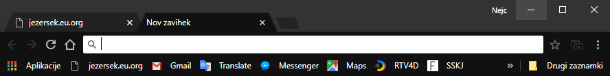

# Chrome Dark Theme
Beautiful dark theme for Google Chrome.

## How to install
Download this repository and extract it. Go to **[chrome://extensions/](chrome://extensions/)** and enable **developer mode**. Click on **load unpacked** button and select folder which contains manifest.json. Enjoj your dark theme.

## How to edit
You can edit this theme by changing the colors in **manifest.json** and recoloring images **theme_frame.png**, **theme_tab_background.png** and **theme_toolbar.png** in images folder.
